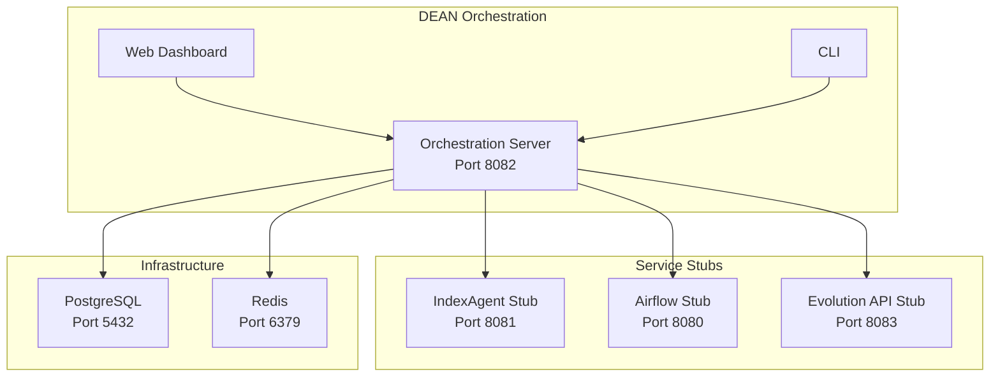

# Development with Service Stubs

## Overview

The DEAN orchestration system is designed as a microservices architecture that depends on three external services:
- **IndexAgent** (Port 8081): Code search and agent management
- **Airflow** (Port 8080): Workflow orchestration
- **Evolution API** (Port 8083): Evolution trial execution

To enable standalone development without deploying these external services, we provide lightweight stub implementations that simulate their APIs.

## Quick Start

### Starting the Development Environment

```bash
# Start all services (stubs + orchestration)
./scripts/dev_environment.sh

# Or use Docker Compose
docker-compose -f docker-compose.dev.yml up
```

This will start:
1. PostgreSQL and Redis infrastructure
2. All three service stubs
3. The DEAN orchestration server
4. Open the dashboard in your browser

### Stopping the Environment

```bash
# Stop all services
./scripts/stop_dev_environment.sh

# Or with Docker Compose
docker-compose -f docker-compose.dev.yml down
```

## Architecture

### Service Stubs

Each stub is a minimal FastAPI application that:
- Implements the exact API expected by the orchestration layer
- Stores data in memory (not persistent across restarts)
- Provides realistic mock responses
- Simulates processing delays
- Logs all requests for debugging



### Stub Implementations

#### IndexAgent Stub (`service_stubs/indexagent/`)
- **Purpose**: Simulates agent creation, evolution operations, and code search
- **Key Features**:
  - Agent CRUD operations with fitness scoring
  - Population management for evolution
  - Mock pattern discovery
  - Simulated code search results

#### Airflow Stub (`service_stubs/airflow/`)
- **Purpose**: Simulates Airflow v2 REST API for workflow management
- **Key Features**:
  - Basic authentication (airflow/airflow)
  - DAG listing and triggering
  - DAG run state transitions
  - Task instance tracking

#### Evolution API Stub (`service_stubs/evolution/`)
- **Purpose**: Simulates evolution trial execution
- **Key Features**:
  - Asynchronous trial execution
  - Real-time progress via WebSocket
  - Pattern discovery simulation
  - Realistic timing and state changes

## Development Workflows

### 1. Testing New Features

When developing new orchestration features:

```python
# Your orchestration code can call services normally
from integration import create_service_pool

async with create_service_pool() as pool:
    # This will connect to the stub services
    agent = await pool.indexagent.create_agent({
        "name": "test-agent",
        "language": "python"
    })
```

### 2. Modifying Stub Behavior

To test specific scenarios, modify stub responses:

```python
# In service_stubs/indexagent/main.py
@app.post("/agents")
async def create_agent(config: AgentConfig):
    # Add custom behavior for testing
    if config.name == "fail-test":
        raise HTTPException(status_code=500, detail="Simulated failure")
    
    # Normal processing...
```

### 3. Running Integration Tests

```bash
# Run tests against stubs
pytest tests/integration/test_with_stubs.py -v

# Run specific test
pytest tests/integration/test_with_stubs.py::TestWithServiceStubs::test_evolution_trial_via_stub -v
```

### 4. Debugging with Logs

All services log to stdout. View logs:

```bash
# View all logs
docker-compose -f docker-compose.dev.yml logs -f

# View specific service
docker-compose -f docker-compose.dev.yml logs -f indexagent-stub

# Orchestration logs (if running outside Docker)
tail -f logs/dev/orchestration.log
```

## Configuration

### Environment Variables

The development environment uses these key variables:

```bash
# Service URLs (defaults for local development)
INDEXAGENT_API_URL=http://localhost:8081
AIRFLOW_API_URL=http://localhost:8080  
EVOLUTION_API_URL=http://localhost:8083

# Database
POSTGRES_HOST=localhost
POSTGRES_PORT=5432
POSTGRES_USER=dean
POSTGRES_PASSWORD=dean123

# Redis
REDIS_HOST=localhost
REDIS_PORT=6379
```

### Stub Configuration

Each stub can be configured via environment variables:

```bash
# Logging
LOG_LEVEL=INFO  # or DEBUG for more detail

# Service-specific
AIRFLOW_USERNAME=airflow
AIRFLOW_PASSWORD=airflow
```

## Transitioning to Real Services

### 1. Service Discovery

The orchestration layer uses environment variables for service discovery, making it easy to switch:

```bash
# Development (stubs)
export INDEXAGENT_API_URL=http://localhost:8081

# Production (real service)  
export INDEXAGENT_API_URL=http://indexagent.production.example.com:8081
```

### 2. API Compatibility

The stubs implement the exact same APIs as the real services. No code changes needed when switching.

### 3. Migration Checklist

- [ ] Deploy real services to their respective infrastructure
- [ ] Update service URLs in environment configuration
- [ ] Run integration tests against real services
- [ ] Update monitoring to include real service metrics
- [ ] Remove stub containers from deployment

## Known Limitations

### Data Persistence
- Stubs store data in memory only
- Data is lost when services restart
- No cross-stub data sharing (each stub is isolated)

### Feature Completeness
- Stubs implement core APIs only
- Advanced features may not be simulated
- Performance characteristics differ from real services

### Simulation Accuracy
- Processing delays are simulated, not real
- Evolution results are randomly generated
- Search results are mocked, not from actual code

## Troubleshooting

### Port Conflicts

```bash
# Check what's using a port
lsof -i :8081

# Kill process using port
kill -9 $(lsof -ti:8081)
```

### Service Won't Start

1. Check logs: `docker-compose logs service-name`
2. Verify port availability
3. Check Docker daemon is running
4. Ensure sufficient resources (RAM/CPU)

### Connection Errors

1. Verify all services are healthy:
   ```bash
   curl http://localhost:8081/health
   curl http://localhost:8080/health
   curl http://localhost:8083/health
   ```

2. Check network connectivity:
   ```bash
   docker network ls
   docker network inspect dean-dev-network
   ```

### Database Issues

```bash
# Connect to PostgreSQL
docker exec -it dean-postgres-dev psql -U dean

# List databases
\l

# Check connections
SELECT * FROM pg_stat_activity;
```

## Best Practices

1. **Keep Stubs Simple**: Don't add complex business logic
2. **Match Real APIs**: Any API changes should mirror real services
3. **Use Realistic Data**: Generate plausible mock data
4. **Log Everything**: Helps with debugging integration issues
5. **Test Error Cases**: Stubs should simulate failures too

## Contributing

When modifying stubs:

1. Update the API contract documentation
2. Add tests for new endpoints
3. Document any new mock behaviors
4. Ensure backward compatibility

## Next Steps

- Review [API Contracts](./API_CONTRACTS.md) for detailed endpoint documentation
- See [Integration Tests](../../tests/integration/README.md) for testing examples
- Check [Deployment Guide](../deployment/README.md) for production setup