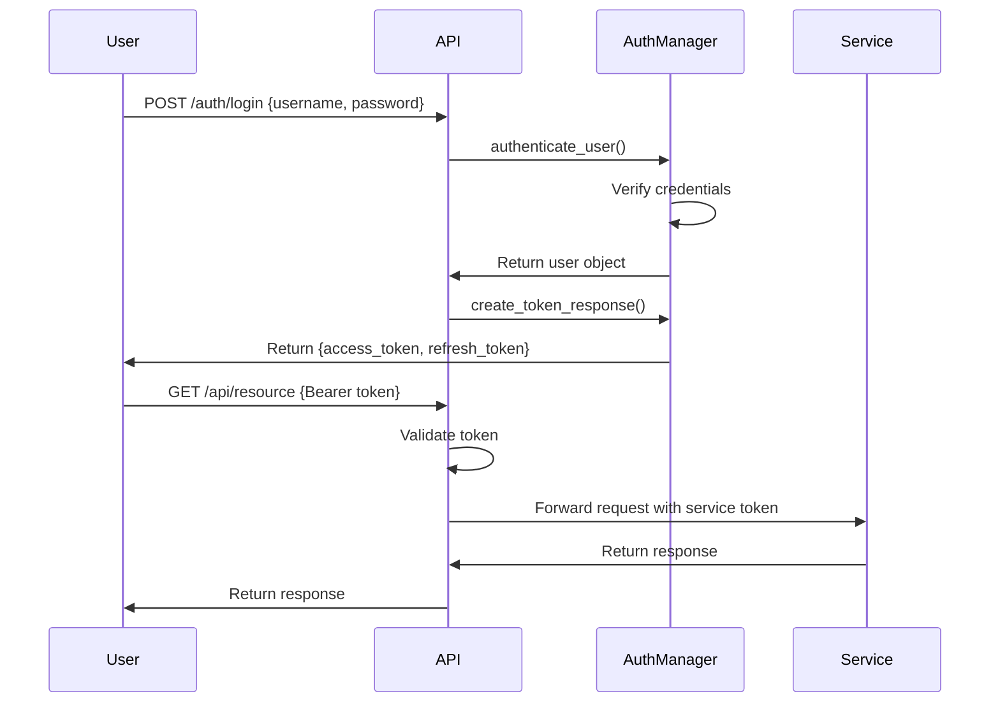

# DEAN Orchestration System Security Guide

## Table of Contents
1. [Overview](#overview)
2. [Authentication Architecture](#authentication-architecture)
3. [Authorization and Roles](#authorization-and-roles)
4. [API Security](#api-security)
5. [Token Management](#token-management)
6. [Service-to-Service Communication](#service-to-service-communication)
7. [Security Configuration](#security-configuration)
8. [Best Practices](#best-practices)
9. [Known Limitations](#known-limitations)

## Overview

The DEAN orchestration system implements a comprehensive security model based on JWT (JSON Web Token) authentication and role-based access control (RBAC). This guide provides detailed information on configuring and maintaining security across all system components.

## Authentication Architecture

### Components

1. **Authentication Manager** (`src/auth/auth_manager.py`)
   - Handles user authentication and token generation
   - Manages user sessions and refresh tokens
   - Implements account lockout for failed attempts

2. **Authentication Middleware** (`src/auth/auth_middleware.py`)
   - Validates tokens on incoming requests
   - Enforces role-based access control
   - Provides decorators for protecting endpoints

3. **Authentication Utilities** (`src/auth/auth_utils.py`)
   - JWT token creation and validation
   - Password hashing using bcrypt
   - API key generation and validation

### Authentication Flow



## Authorization and Roles

### User Roles

1. **ADMIN** - Full system access
   - User management
   - System configuration
   - All agent operations
   - Deployment control

2. **USER** - Standard access
   - Create and manage agents
   - Start evolution trials
   - View results and patterns
   - Cannot modify system config

3. **VIEWER** - Read-only access
   - View agents and results
   - Access metrics and logs
   - Cannot create or modify

4. **SERVICE** - Service account
   - Inter-service communication
   - Automated operations
   - Limited to service APIs

### Role Enforcement

```python
# Protecting endpoints with roles
@app.get("/api/admin/users")
@require_roles([UserRole.ADMIN])
async def list_users(request: Request):
    # Only admins can access
    pass

@app.post("/api/agents")
@require_roles([UserRole.USER, UserRole.ADMIN])
async def create_agent(request: Request):
    # Users and admins can create agents
    pass
```

## API Security

### Protected Endpoints

All endpoints except the following require authentication:
- `/health` - Health check
- `/auth/login` - Login endpoint
- `/docs` - API documentation (configurable)

### Security Headers

The system sets the following security headers:
- `X-Content-Type-Options: nosniff`
- `X-Frame-Options: DENY`
- `X-XSS-Protection: 1; mode=block`
- `Strict-Transport-Security: max-age=31536000; includeSubDomains`

### CORS Configuration

```python
# Production CORS settings
ALLOWED_ORIGINS = [
    "https://your-frontend.com",
    "https://monitoring.your-domain.com"
]
```

## Token Management

### Access Tokens
- **Purpose**: API authentication
- **Lifetime**: 30 minutes (configurable)
- **Format**: JWT with user claims
- **Usage**: `Authorization: Bearer <token>`

### Refresh Tokens
- **Purpose**: Obtain new access tokens
- **Lifetime**: 7 days (configurable)
- **Storage**: Server-side tracking
- **Single-use**: Rotated on each refresh

### Token Structure

```json
{
  "sub": "user-uuid",
  "username": "john.doe",
  "roles": ["user"],
  "type": "access",
  "exp": 1234567890,
  "iat": 1234567890,
  "nbf": 1234567890
}
```

### API Keys
- **Purpose**: Long-lived authentication for automation
- **Format**: Random 32-character string
- **Storage**: Hashed in database
- **Rotation**: Recommended every 90 days

## Service-to-Service Communication

### Service Authentication

Services authenticate using dedicated service accounts:

```python
# Service token generation
service_token = create_access_token(
    user_id="service-orchestrator",
    username="dean-orchestrator",
    roles=[UserRole.SERVICE],
    expires_delta=timedelta(hours=24)
)
```

### Authentication Flow

1. Orchestrator receives user request with user token
2. Validates user token and extracts user context
3. Creates service token with user context in claims
4. Makes service call with service token
5. Service validates token and logs user context

## Security Configuration

### Environment Variables

```bash
# JWT Configuration
JWT_SECRET_KEY="your-strong-secret-key-change-in-production"
JWT_ALGORITHM="HS256"
ACCESS_TOKEN_EXPIRE_MINUTES=30
REFRESH_TOKEN_EXPIRE_DAYS=7

# Password Policy
PASSWORD_MIN_LENGTH=8
PASSWORD_REQUIRE_UPPERCASE=true
PASSWORD_REQUIRE_NUMBERS=true
PASSWORD_REQUIRE_SPECIAL=true

# Account Security
MAX_LOGIN_ATTEMPTS=5
LOCKOUT_DURATION_MINUTES=15

# Service Authentication
SERVICE_API_KEY="your-service-api-key"
AIRFLOW_USERNAME="airflow"
AIRFLOW_PASSWORD="secure-password"
```

### SSL/TLS Configuration

```yaml
# docker-compose.yml
services:
  dean-server:
    environment:
      - SSL_CERT_FILE=/certs/server.crt
      - SSL_KEY_FILE=/certs/server.key
      - ENFORCE_HTTPS=true
    volumes:
      - ./certs:/certs:ro
```

## Best Practices

### Password Management

1. **Default Passwords**: Change all default passwords immediately
   ```bash
   # Change default admin password
   dean-cli user change-password --username admin
   ```

2. **Password Requirements**:
   - Minimum 8 characters
   - At least one uppercase letter
   - At least one number
   - At least one special character

3. **Password Storage**: Never store passwords in:
   - Configuration files
   - Environment variables (use secrets management)
   - Version control

### Token Security

1. **Token Storage**:
   - Never store tokens in localStorage (use httpOnly cookies)
   - Clear tokens on logout
   - Implement token blacklisting for revocation

2. **Token Transmission**:
   - Always use HTTPS
   - Never include tokens in URLs
   - Use secure WebSocket connections

### API Key Management

1. **Generation**:
   ```bash
   # Generate API key for monitoring service
   dean-cli apikey create --name "Monitoring Service" --roles viewer
   ```

2. **Rotation**:
   - Rotate keys every 90 days
   - Support multiple active keys during rotation
   - Log key usage for audit

### Audit and Monitoring

1. **Security Events to Log**:
   - Login attempts (success/failure)
   - Token generation and refresh
   - API key usage
   - Authorization failures
   - Configuration changes

2. **Monitoring Alerts**:
   - Multiple failed login attempts
   - Unusual API activity
   - Expired certificate warnings
   - Service authentication failures

## Known Limitations

### Current Implementation

1. **In-Memory Storage**: 
   - User data and tokens stored in memory
   - Data lost on restart
   - Not suitable for multi-instance deployment

2. **Basic Role Model**:
   - Fixed roles without fine-grained permissions
   - No custom role creation
   - No attribute-based access control

3. **Token Revocation**:
   - No immediate revocation mechanism
   - Relies on short token lifetime
   - No token blacklisting

### Future Enhancements

1. **Database Integration**:
   - PostgreSQL user storage
   - Redis session management
   - Distributed token validation

2. **Enhanced Authentication**:
   - OAuth2/OpenID Connect support
   - SAML integration
   - Multi-factor authentication

3. **Advanced Authorization**:
   - Policy-based access control
   - Resource-level permissions
   - Dynamic role assignment

4. **Security Features**:
   - Rate limiting per user/IP
   - Geo-blocking capabilities
   - Anomaly detection

## Security Checklist

### Deployment Checklist

- [ ] Change all default passwords
- [ ] Generate strong JWT secret key
- [ ] Configure SSL/TLS certificates
- [ ] Set up firewall rules
- [ ] Enable audit logging
- [ ] Configure monitoring alerts
- [ ] Test authentication flows
- [ ] Verify role enforcement
- [ ] Document emergency procedures

### Regular Maintenance

- [ ] Monthly: Review user access
- [ ] Quarterly: Rotate API keys
- [ ] Quarterly: Update dependencies
- [ ] Annually: Security audit
- [ ] As needed: Update passwords

## Emergency Procedures

### Suspected Breach

1. **Immediate Actions**:
   ```bash
   # Revoke all tokens
   dean-cli security revoke-all-tokens
   
   # Force password reset
   dean-cli security force-password-reset --all-users
   
   # Rotate JWT secret
   dean-cli security rotate-jwt-secret
   ```

2. **Investigation**:
   - Review audit logs
   - Check for unauthorized access
   - Identify affected resources

3. **Recovery**:
   - Reset all credentials
   - Audit user permissions
   - Update security policies

### Lost Admin Access

```bash
# Emergency admin recovery (requires system access)
dean-cli user create-admin \
  --username emergency-admin \
  --email admin@emergency.local \
  --bypass-auth
```

## Support

For security issues or questions:
- Documentation: https://dean-docs.example.com/security
- Security Email: security@dean-system.example.com
- Emergency: Follow incident response procedure